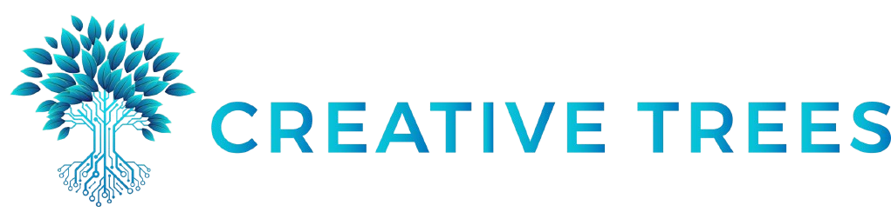

# Creative Trees Group

**Mitra rekayasa perangkat lunak untuk sistem bisnis yang kritikal — pembayaran, inventori, keuangan, hingga akademik.**

   

## Tentang Kami

Creative Trees Group adalah tim rekayasa perangkat lunak yang membangun sistem bisnis untuk kebutuhan yang nyata: transaksi yang harus tercatat benar, stok yang harus akurat, dan data yang harus bisa dipercaya. Kami mengutamakan arsitektur yang bersih, kode yang mudah dirawat, dan keamanan sejak tahap desain.

## Bidang Keahlian

Kami mengerjakan sistem lintas domain, dengan fokus utama pada:

- **Sistem Pembayaran** — pemrosesan transaksi, rekonsiliasi, dan integrasi payment gateway.
- **Manajemen Gudang & Inventori** — pelacakan stok, pergudangan, dan rantai pasok.
- **ERP & Keuangan** — pencatatan keuangan, pelaporan, dan otomasi proses bisnis.
- **Sistem Informasi Akademik** — manajemen data universitas dan layanan akademik.
- **Donasi & CMS** — platform donasi serta sistem manajemen konten.
- **Monitoring Layanan & Tiket** — pemantauan status layanan dan alur tiket dukungan.

## Teknologi yang Kami Pakai

Mayoritas proyek kami dibangun di atas **Laravel/PHP** untuk backend, **Svelte** untuk antarmuka yang cepat dan ringan, serta **Python** untuk skrip pendukung dan otomasi.

## Repositori Pilihan

- **[FinanSphere-Kelola-Keuangan](https://github.com/Creative-Trees/FinanSphere-Kelola-Keuangan)** — aplikasi pengelolaan keuangan.
- **[Backend-University-Management-System](https://github.com/Creative-Trees/Backend-University-Management-System)** — backend sistem manajemen universitas.
- **[SGI-X-SPX-Tracker](https://github.com/Creative-Trees/SGI-X-SPX-Tracker)** — sistem pelacakan berbasis PHP.
- **[Zenith-Maintenance](https://github.com/Creative-Trees/Zenith-Maintenance)** — sistem monitoring dan maintenance.

## Filosofi

Nama Creative Trees terinspirasi dari pohon — simbol pertumbuhan, ketahanan, dan koneksi yang mengakar kuat:

- **Akar** — fondasi kepercayaan dan nilai-nilai yang kami pegang.
- **Batang** — stabilitas arsitektur dan teknologi yang kami bangun.
- **Cabang & Daun** — pertumbuhan dan ekspansi ke kebutuhan baru.
- **Buah** — solusi nyata yang memberi manfaat bagi pengguna.

## Kontribusi & Komunitas

Kami menyambut kontribusi dari siapa pun. Sebelum membuka pull request atau issue, silakan baca:

- [Kode Etik Kontributor](https://github.com/Creative-Trees/.github/blob/main/CODE_OF_CONDUCT.md)
- [Panduan Berkontribusi](https://github.com/Creative-Trees/.github/blob/main/CONTRIBUTING.md)
- [Kebijakan Keamanan](https://github.com/Creative-Trees/.github/blob/main/SECURITY.md)
- [Dukungan & Bantuan](https://github.com/Creative-Trees/.github/blob/main/SUPPORT.md)

## Hubungi Kami

Punya pertanyaan atau ingin berkolaborasi? Hubungi kami melalui teamcreativetrees@gmail.com.

---

Creative Trees Group — mengakar kuat, tumbuh berkelanjutan.

